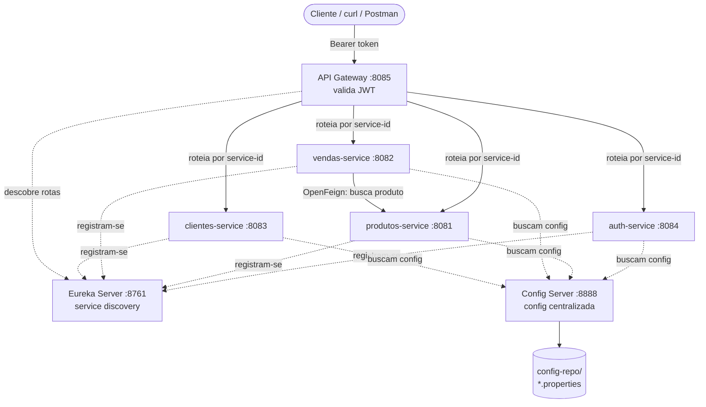

# API de Vendas — Arquitetura de Microsserviços

Sistema de e-commerce simples dividido em microsserviços Spring Boot, com
descoberta de serviços (Eureka), configuração centralizada (Config Server),
porta de entrada única (API Gateway) e autenticação via JWT.

> Stack: Java 17 · Spring Boot 3.2.5 · Spring Cloud (Eureka, Config, Gateway,
> OpenFeign) · H2 (em memória) · Docker Compose · Kubernetes (kind).

---

## Índice

- [Arquitetura](#arquitetura)
- [Serviços e portas](#serviços-e-portas)
- [Infraestrutura](#infraestrutura)
- [Como rodar](#como-rodar)
  - [Docker Compose (recomendado)](#docker-compose-recomendado)
  - [Kubernetes (kind)](#kubernetes-kind)
  - [Local (sem Docker)](#local-sem-docker)
- [Autenticação (JWT)](#autenticação-jwt)
- [Endpoints e exemplos](#endpoints-e-exemplos)
- [Dados de exemplo (seed)](#dados-de-exemplo-seed)
- [Consoles úteis](#consoles-úteis)
- [Troubleshooting](#troubleshooting)

---

## Arquitetura



Fluxo geral:

1. Os serviços sobem e se **registram no Eureka**.
2. Cada serviço busca sua configuração no **Config Server**, que lê os arquivos
   em `config-repo/`.
3. O **Gateway** descobre as rotas pelo Eureka e expõe tudo em uma porta única
   (`8085`), usando o prefixo `/{nome-do-serviço}/...`.
4. O Gateway **valida o JWT** em toda rota, exceto login e registro.
5. O `vendas-service` chama o `produtos-service` via **OpenFeign** para obter o
   preço do produto ao registrar uma venda.

---

## Serviços e portas

| Serviço            | Porta | Responsabilidade                                        | Banco (H2)   |
| ------------------ | ----- | ------------------------------------------------------- | ------------ |
| `eureka-server`    | 8761  | Service discovery (registro/descoberta)                 | —            |
| `config-server`    | 8888  | Configuração centralizada (lê `config-repo/`)           | —            |
| `gateway`          | 8085  | Porta de entrada única + validação de JWT               | —            |
| `auth-service`     | 8084  | Registro/login de usuários, emissão de JWT              | `authdb`     |
| `produtos-service` | 8081  | CRUD de produtos                                         | `produtosdb` |
| `vendas-service`   | 8082  | Registro de vendas (consulta produtos via Feign)        | `vendasdb`   |
| `clientes-service` | 8083  | Consulta de clientes                                    | `clientesdb` |

> Todos os bancos são **H2 em memória** — os dados são recriados a cada
> reinício, junto com os dados de exemplo (seed).

---

## Infraestrutura

### Configuração centralizada

Os arquivos em `config-repo/` são servidos pelo Config Server. Cada serviço tem
dois arquivos:

- `<serviço>.properties` — perfil padrão (execução local).
- `<serviço>-docker.properties` — perfil `docker`, sobrescreve endereços
  (`localhost` → nome do serviço na rede Docker).

O Config Server usa o backend **native** (lê arquivos `.properties` de uma pasta
montada), e não o backend Git. No `docker-compose.yml` a pasta é montada como
volume em `/config-repo`.

### Docker

Cada serviço tem um `Dockerfile` multi-stage:

- **Estágio build**: `maven:3.9-eclipse-temurin-17` compila e empacota o `.jar`.
- **Estágio runtime**: `eclipse-temurin:17-jre` roda apenas o `.jar` (imagem
  final enxuta).

O `docker-compose.yml` orquestra todos os serviços numa rede bridge
(`microservicos-net`), com `healthcheck` no Eureka e no Config Server para
garantir a ordem de subida (`depends_on: condition: service_healthy`).

### Kubernetes

A pasta `k8s/` contém os manifests (`Namespace`, `Deployment`, `Service` por
componente) para rodar num cluster local com **kind**. Veja
[k8s/README.md](k8s/README.md) para o passo a passo e as pegadinhas de
configuração (backend native, `SPRING_APPLICATION_JSON` para o Eureka, IP do Pod).

---

## Como rodar

### Docker Compose (recomendado)

Pré-requisitos: Docker + Docker Compose.

```bash
# na raiz do projeto
docker compose up -d --build
```

> Use sempre `--build` após alterar código ou `.properties`, senão o container
> continua rodando a imagem/jar antiga.

Acompanhe a subida:

```bash
docker compose ps
docker compose logs -f gateway
```

Aguarde todos ficarem saudáveis. O ponto de entrada é o Gateway em
`http://localhost:8085`.

Para derrubar tudo:

```bash
docker compose down
```

### Kubernetes (kind)

Veja o guia completo em [k8s/README.md](k8s/README.md). Resumo:

```bash
kind create cluster --name ecommerce
# build + load das imagens, depois:
kubectl apply -f k8s/
kubectl get pods -n ecommerce -w
kubectl port-forward -n ecommerce svc/gateway 8085:8085
```

### Local (sem Docker)

Requer JDK 17 e Maven. Suba **na ordem** (cada um em um terminal):

```bash
# 1. Eureka
cd eureka-server && ./mvnw spring-boot:run
# 2. Config Server
cd config-server && ./mvnw spring-boot:run
# 3. Serviços de negócio (qualquer ordem)
cd produtos-service && ./mvnw spring-boot:run
cd vendas-service   && ./mvnw spring-boot:run
cd clientes-service && ./mvnw spring-boot:run
cd auth-service     && ./mvnw spring-boot:run
# 4. Gateway
cd gateway && ./mvnw spring-boot:run
```

No modo local os serviços usam `localhost` (perfil padrão). Você pode acessá-los
diretamente pelas portas individuais ou pelo Gateway em `8085`.

---

## Autenticação (JWT)

O `auth-service` emite um JWT no login. O `gateway` valida esse token em **todas
as rotas**, exceto:

- `POST /auth-service/api/auth/register`
- `POST /auth-service/api/auth/login`

Nas demais rotas, envie o header:

```
Authorization: Bearer <token>
```

Sem token → `401 Unauthorized`. Token inválido/expirado → `403 Forbidden`.

> O segredo de assinatura (`jwt.secret`) é compartilhado entre `auth-service` e
> `gateway`. O valor no repositório é de desenvolvimento — **troque em produção**.
> Expiração padrão: 1 hora (`jwt.expiration-ms=3600000`).

---

## Endpoints e exemplos

Todos os exemplos abaixo passam pelo **Gateway** (`http://localhost:8085`),
usando o prefixo `/{nome-do-serviço}`. Você também pode chamar cada serviço
diretamente na porta dele (ex.: `http://localhost:8081/produtos`).

### 1. Registrar usuário (público)

```bash
curl -X POST http://localhost:8085/auth-service/api/auth/register \
  -H "Content-Type: application/json" \
  -d '{
    "username": "caio",
    "password": "senha123",
    "email": "caio@exemplo.com"
  }'
```

Resposta (`200 OK`):

```json
{ "id": "b1f2...uuid", "username": "caio", "email": "caio@exemplo.com" }
```

### 2. Login (público) → obter token

```bash
curl -X POST http://localhost:8085/auth-service/api/auth/login \
  -H "Content-Type: application/json" \
  -d '{
    "email": "caio@exemplo.com",
    "password": "senha123"
  }'
```

Resposta (`201 Created`):

```json
{ "token": "eyJhbGciOiJIUzI1NiJ9...", "tokenType": "Bearer" }
```

Guarde o token numa variável para os próximos comandos:

```bash
TOKEN=$(curl -s -X POST http://localhost:8085/auth-service/api/auth/login \
  -H "Content-Type: application/json" \
  -d '{"email":"caio@exemplo.com","password":"senha123"}' | jq -r .token)
```

### 3. Listar produtos (protegido)

```bash
curl http://localhost:8085/produtos-service/produtos \
  -H "Authorization: Bearer $TOKEN"
```

Resposta:

```json
[
  { "id": 1, "nome": "Notebook", "preco": 3500.00 },
  { "id": 2, "nome": "Mouse sem fio", "preco": 79.90 }
]
```

Buscar um produto por id:

```bash
curl http://localhost:8085/produtos-service/produtos/1 \
  -H "Authorization: Bearer $TOKEN"
```

### 4. Registrar uma venda (protegido)

O `vendas-service` busca o produto no `produtos-service` (via Feign) e calcula o
valor a partir do preço atual.

```bash
curl -X POST http://localhost:8085/vendas-service/vendas \
  -H "Authorization: Bearer $TOKEN" \
  -H "Content-Type: application/json" \
  -d '{
    "idProduto": 1,
    "quantidade": 2
  }'
```

Resposta (`200 OK`):

```json
{ "id": 1, "idProduto": 1, "quantidade": 2, "preco": 3500.00 }
```

### 5. Listar clientes (protegido)

```bash
curl http://localhost:8085/clientes-service/clientes \
  -H "Authorization: Bearer $TOKEN"
```

Resposta:

```json
[
  { "id": 1, "nome": "Ana Souza", "email": "ana.souza@exemplo.com" },
  { "id": 2, "nome": "Bruno Lima", "email": "bruno.lima@exemplo.com" }
]
```

### 6. Gerenciar usuários (protegido)

```bash
# listar
curl http://localhost:8085/auth-service/api/users \
  -H "Authorization: Bearer $TOKEN"

# buscar por id
curl http://localhost:8085/auth-service/api/users/<uuid> \
  -H "Authorization: Bearer $TOKEN"

# atualizar
curl -X PUT http://localhost:8085/auth-service/api/users/<uuid> \
  -H "Authorization: Bearer $TOKEN" \
  -H "Content-Type: application/json" \
  -d '{ "username": "novo_nome", "email": "novo@exemplo.com" }'

# remover
curl -X DELETE http://localhost:8085/auth-service/api/users/<uuid> \
  -H "Authorization: Bearer $TOKEN"
```

### Resumo dos endpoints

| Método | Rota (via gateway)                        | Auth | Descrição                     |
| ------ | ----------------------------------------- | ---- | ----------------------------- |
| POST   | `/auth-service/api/auth/register`         | ❌   | Cria usuário                  |
| POST   | `/auth-service/api/auth/login`            | ❌   | Login, retorna JWT            |
| GET    | `/auth-service/api/users`                 | ✅   | Lista usuários                |
| GET    | `/auth-service/api/users/{id}`            | ✅   | Busca usuário por id          |
| PUT    | `/auth-service/api/users/{id}`            | ✅   | Atualiza usuário              |
| DELETE | `/auth-service/api/users/{id}`            | ✅   | Remove usuário                |
| GET    | `/produtos-service/produtos`              | ✅   | Lista produtos                |
| GET    | `/produtos-service/produtos/{id}`         | ✅   | Busca produto por id          |
| GET    | `/vendas-service/vendas`                  | ✅   | Health check simples          |
| POST   | `/vendas-service/vendas`                  | ✅   | Registra venda                |
| GET    | `/clientes-service/clientes`              | ✅   | Lista clientes                |

---

## Dados de exemplo (seed)

Ao subir, `produtos-service` e `clientes-service` populam o H2 automaticamente
(via `CommandLineRunner`):

- **10 produtos** (Notebook, Mouse sem fio, Teclado mecânico, Monitor 27",
  Webcam Full HD, Headset gamer, SSD 1TB, Cadeira de escritório,
  Carregador USB-C 65W, Smartphone).
- **10 clientes** (Ana Souza, Bruno Lima, Carla Mendes, ...).

---

## Consoles úteis

| Console                 | URL                                   |
| ----------------------- | ------------------------------------- |
| Painel do Eureka        | http://localhost:8761                 |
| Config Server (health)  | http://localhost:8888/actuator/health |
| H2 — produtos           | http://localhost:8081/h2-console      |
| H2 — vendas             | http://localhost:8082/h2-console      |
| H2 — clientes           | http://localhost:8083/h2-console      |
| H2 — auth               | http://localhost:8084/h2-console      |

Credenciais do H2: usuário `sa`, senha em branco. A JDBC URL é a de cada serviço
(ex.: `jdbc:h2:mem:produtosdb`).

---

## Troubleshooting

- **Container rodando código antigo**: rode `docker compose up -d --build`
  (apenas `up -d` reaproveita a imagem antiga).
- **Serviço não aparece no Eureka**: confira a env
  `EUREKA_CLIENT_SERVICEURL_DEFAULTZONE` e se o Eureka já está saudável.
- **404/500 no gateway**: o serviço destino pode não ter se registrado ainda no
  Eureka, ou subiu na porta errada (config não carregada). Verifique os logs do
  Config Server e do serviço.
- **401/403 em rotas protegidas**: token ausente/expirado. Faça login de novo.
- **Kubernetes**: veja as três pegadinhas comuns em
  [k8s/README.md](k8s/README.md) (backend native, `SPRING_APPLICATION_JSON`,
  IP do Pod).
